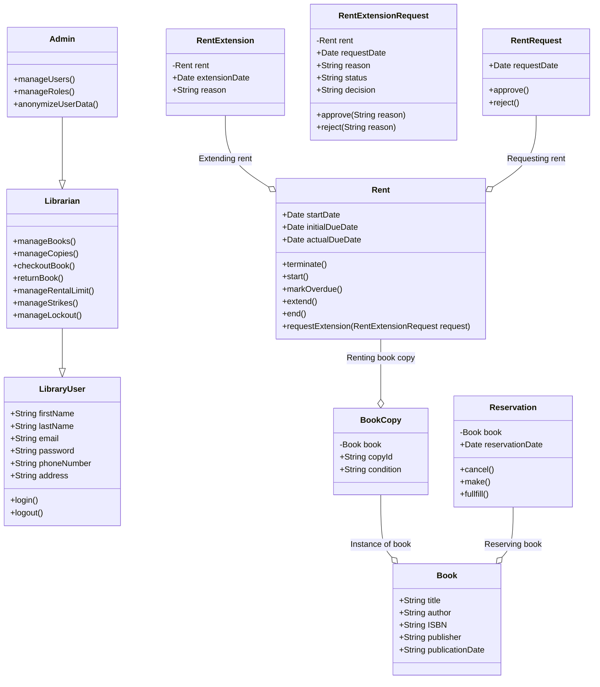

# Conceptual Class Diagram

```mermaid
classDiagram
    class LibraryUser {
        +String firstName
        +String lastName
        +String email
        +String password
        +String phoneNumber
        +String address
        +login()
        +logout()
    }
    
    class Librarian {
        +manageBooks()
        +manageCopies()
        +checkoutBook()
        +returnBook()
        +manageRentalLimit()
        +manageStrikes()
        +manageLockout()
    }
    
    class Admin {
        +manageUsers()
        +manageRoles()
        +anonymizeUserData()
    }
    
    Librarian --|> LibraryUser
    Admin --|> Librarian
    
    class Book {
        +String title
        +String author
        +String ISBN
        +String publisher
        +String publicationDate
    }
    
    class BookCopy {
        -Book book
        +String copyId
        +String condition
    }

    BookCopy --o Book : Instance of book
    Rent --o BookCopy : Renting book copy
    
    class Rent {
        +Date startDate
        +Date initialDueDate
        +Date actualDueDate
        +terminate()
        +start()
        +markOverdue()
        +extend()
        +end()
        +requestExtension(RentExtensionRequest request)
    }
    
    class RentExtension {
        -Rent rent
        +Date extensionDate
        +String reason
    }
    
    class RentExtensionRequest {
        -Rent rent
        +Date requestDate
        +String reason
        +String status
        +String decision
        +approve(String reason)
        +reject(String reason)
    }
    
    RentExtension --o Rent : Extending rent
    
    class Reservation {
        -Book book
        +Date reservationDate
        +cancel()
        +make()
        +fullfill()
    }
    
    Reservation --o Book : Reserving book
    
    class RentRequest {
        +Date requestDate
        +approve()
        +reject()
    }
    
    RentRequest --o Rent : Requesting rent
    
```