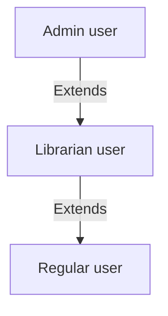

# Terminology
This document defines the terminology used in the system design.

## User
User represents a person who interacts with the system. Users can have different roles, which determine their permissions and capabilities within the system.

Roles include:
- **Admin**: An admin user has the highest level of access and can manage most of the aspects of the system, including user management, role management, and data privacy compliance.
- **Librarian**: A librarian user can manage library resources, assist users, and perform administrative tasks related to library operations.
- **User**: A regular user can browse and borrow library resources, manage their account, and interact with the system according to their permissions.

## Book
Represents a literary work available in the library.

## Book copy
Represents a physical copy of a book that can be borrowed by users. Each book copy is associated with a specific book.

## Rent
Users can rent books from the library. The rental process involves requesting a book, having the request approved by a librarian, and then borrowing the book for a specified period, by appearing in person at the library to pick it up. Rents can later be extended, if the user needs more time to read the book, and if the librarian approves the extension request.

## Reservation
Users can reserve books that are currently unavailable. When a reserved book becomes available, the user is notified and can then borrow the book.

## Strikes
When user breaks library rules, they may receive strikes. Accumulating too many strikes can lead to temporary or permanent restrictions on the user's ability to borrow books.

