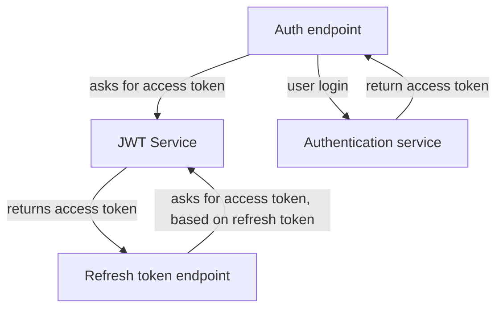

```mermaid
flowchart TD
    AuthEndpoint["Auth endpoint"]
    RefreshEndpoint["Refresh token endpoint"]
    JwtService["JWT Service"]
    AS["Authentication service"]
    
    AuthEndpoint --> |"user login"| AS
    AS --> |"return access token"| AuthEndpoint
    RefreshEndpoint --> |"asks for access token, based on refresh token"| JwtService
    AuthEndpoint --> |"asks for access token"| JwtService
    JwtService --> |"returns access token"| RefreshEndpoint
```