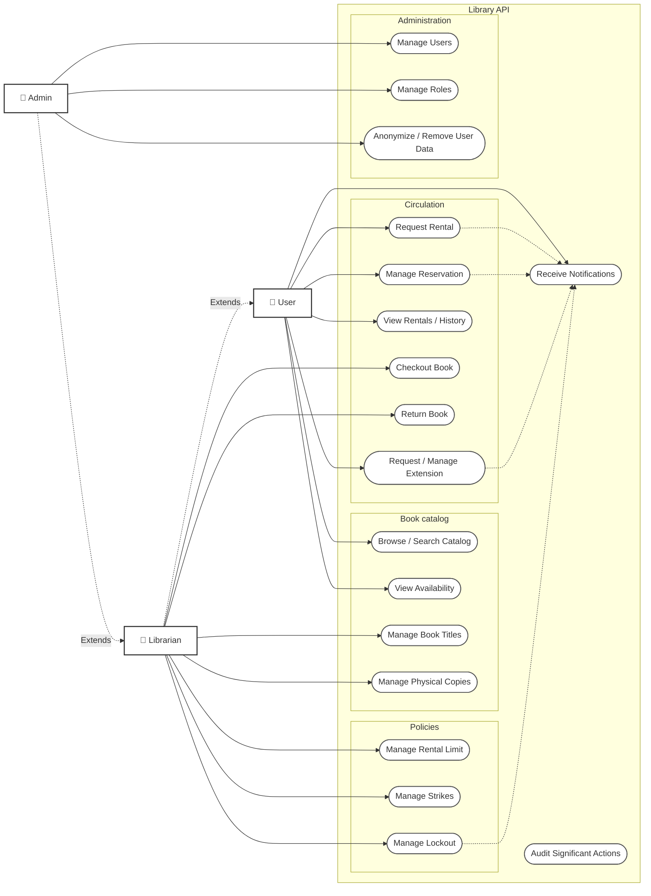

Admin user:
- Can do anything a regular user can do
  User - Most common user, represents people who want to rent books from the library:
- Makes request to rent a book
- View existing requests to rent books
- View existing reservations for books
- View currently rented books, along their info, such as due dates
  Librarian - Represents the library staff who manage the book rental process:
- Approves or denies requests to rent a book
- Dispenses books to users who have been approved to rent them
- Accepts returns of books from users