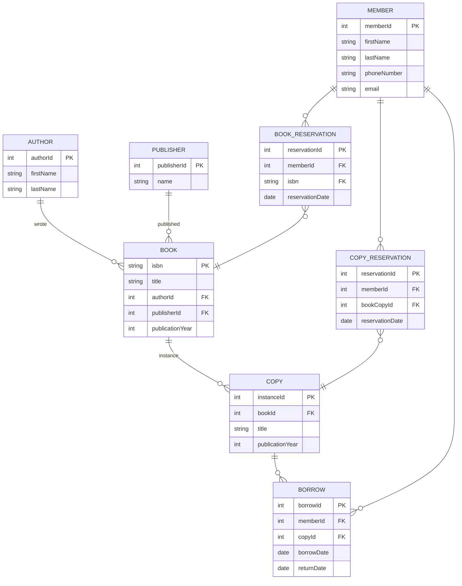

# Terms definitions
- **Author** is one of the beings that wrote a book
- **Publisher** is the entity that published a book
- **Book** is a written work that is published by a publisher and written by one or more authors
- **Copy** is an instance of a book that can be borrowed through the system
- **Member** is an individual who can borrow copies of books from the library
- **Reservation** is a request made by a member to borrow a copy of a book that is currently unavailable. When a copy becomes available, the member is notified and has a certain amount of time to pick up the copy before the reservation is canceled and the copy is made available to other members, prioritizing members who have reserved the copy over those who have not.
- **Members** may reserve a copy of a book or a book itself, therefore two different reservation entities are defined. **BookReservation** and **CopyReservation**.
  - **BookReservation** is made when a member wants to reserve a copy of a book that is currently unavailable. It doesnt care what 
  - **CopyReservation** is made when a member wants to reserve a specific copy of a book that is currently unavailable. U

# Assumptions and constraints:
- **Book**
  - Is published by a single publisher.
  - Can have multiple authors.
  - Can have multiple copies.
  - Can be borrowed by multiple members, but a **copy** can only be borrowed by one **member** at a time.
- **Copy**
  - Is an instance of a single book.
  - Can be borrowed by multiple members over time, but can only be borrowed by one **member** at a time, so two members cannot borrow the same copy at the same time.
- **Publisher**
  - Can publish multiple books.
- **Author**
  - Can write multiple books.
- **Member**
  - Can borrow multiple copies, but a **copy** can only be borrowed by one **member** at a time.

A borrow can be:
- **ACTIVE**: when the copy is currently borrowed by a member.
- **FINISHED**: when the copy has been returned by the member.
- **OVERDUE**: when the copy has not been returned by the member and the return date has passed.

A reservation can be:
- **ACTIVE**: when the copy is currently reserved by a member.
- **CANCELLED_BY_MEMBER**: when the reservation has been cancelled by the member.
- **CANCELLED_BY_LIBRARY**: when the reservation has been cancelled by the library, due to the member not picking up the copy within a certain time frame or other reasons.
- **FINISHED**: when the reservation has been fulfilled and the copy has been borrowed by the member.
